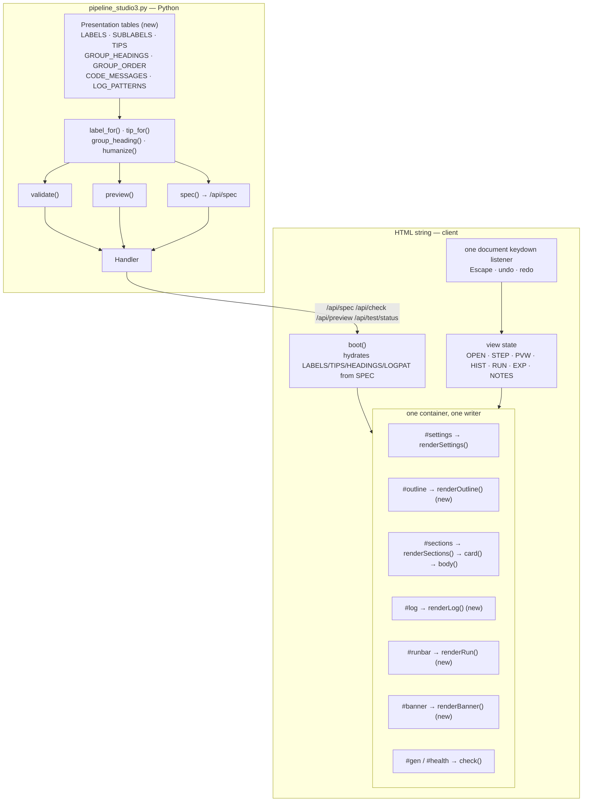
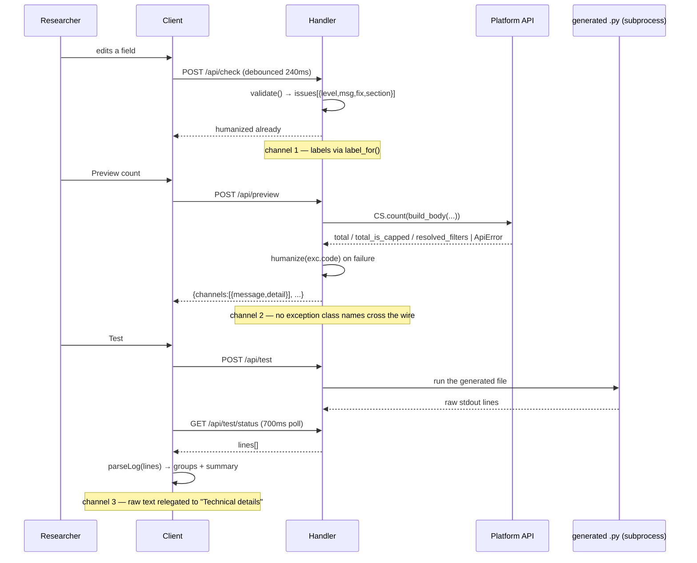

# Design Document

## Overview

Pipelines Studio v3 is one Python file. `pipeline_studio3.py` holds the project schema,
`validate()`, `preview()`, `codegen()`, an HTTP `Handler`, and a single `HTML` string
constant assembled from four `HTML +=` chunks that contain the CSS, the static DOM, and
the whole client. There is no build step, no framework, no bundler, and no JS test
harness. Everything below is designed to stay inside that shape, because the shape is
what makes the tool launchable with whatever `python` is on a researcher's PATH.

This feature is a usability pass over that client, plus the Python-side tables the client
needs to speak plain language. Twelve requirements, grouped by what they actually touch:

| Requirements | What changes | Where |
| --- | --- | --- |
| 2 (labels), 3 (tooltips), 4 (filter groups), 6 (errors) | New Python lookup tables, shipped in `/api/spec` | `spec()`, `validate()`, `preview()` |
| 1 (progressive disclosure), 11 (outline) | New view state + new render containers | HTML chunks 1–3 |
| 5 (preview card), 9 (log panel) | Two renderers replacing monospace blocks | `previewBox()`, `log()` |
| 7 (progress), 12 (export) | Operation lifecycle state | chunk 4 |
| 8 (undo/redo), 10 (onboarding) | Two new client subsystems | chunk 4 |

### The three constraints everything is designed around

**1. Full-innerHTML re-render.** `renderSections()` replaces `#sections` wholesale on
nearly every edit, and `check()` fires it again 240 ms after any keystroke. Anything
attached to a DOM node with `addEventListener` is destroyed by the next render. So all
new interactive behaviour is expressed either as an inline `on*` attribute (part of the
markup, therefore re-emitted every render) or as a single listener on `document` /
on a container element that is itself never replaced (`#log`, `#pane`).

**2. Attribute-keyed focus restoration.** `renderSections()` remembers the focused
field by its `oninput`/`onchange` attribute string, then finds the new element with the
same attribute string and restores the selection range. Two consequences: a collapsed
step must not render its inputs at all (an off-screen duplicate would make the key
ambiguous), and nothing may read state back out of the DOM, because the DOM is discarded.
Every piece of new view state is a module-level JS object keyed by section id.

**3. One container, one render function.** The file already follows this: `#gen`,
`#health`, `#settings`, `#sections`, `#log` each have exactly one writer. New UI gets
new containers (`#outline`, `#runbar`, `#banner`) rather than being folded into an
existing renderer, so that re-rendering the outline can never disturb focus in the
settings pane and vice versa. This is also how Requirement 11.3's cross-container hover
highlight is solved without a shared render pass.

### The one rule that is not negotiable

Test generates the `.py` and runs *that file*, so what a researcher tests is what
Engineering deploys. Nothing here rewrites the generated pipeline's `print()`
statements. Requirement 9's structured log is produced by *reading* stdout, which makes
the Studio a consumer of an incidental text format. That coupling is managed explicitly
in [Log parsing](#log-parsing-requirement-9) rather than pretended away.

### Research notes that shaped the design

- **The archive's filter groups are `snake_case` keys, and there are nine of them, not
  six.** Read from the live cache (`pipelines/generated/_cache/filters.json`):
  `demographics`, `mortgage`, `campaign_flags`, `energy`, `channel_delivery`, `other`,
  `card_offer`, `messaging`, `geography`. Requirement 4.1's six headings are therefore a
  *mapping*, not a rename, and one of the six ("When it ran") has no enhanced filters at
  all today — which is exactly the case Requirement 4.2's hide-empty-groups clause
  covers.
- **Archive filter labels are already prose.** `credit_union` publishes
  `label: "Credit Union"`, `state` publishes `"State / Province"`. So the label mapping
  is an override table over a mostly-good source, not a full translation. But some
  specs have no label at all, and `note` text runs past Requirement 4.5's 120-character
  ceiling (`loan_amount`'s note is ~150), so both a fallback and a truncation rule are
  needed.
- **`cs_api.ApiError` already documents `code` as "the stable thing to branch on"**, with
  `message` explicitly described as human text the service may reword. That makes `code`
  the correct key for the error-humanization table, and it means `hint()` — which
  interpolates raw field names and valid-option lists — is *not* safe to show under
  Requirement 2.9.
- **`--selftest` currently passes** (27 codegen variants, `err=0` on all). It parses the
  generated file with `ast`, screens for JSON-isms and undefined names. It exercises
  `validate()` and `codegen()` but touches no UI code, which is the gap the testing
  strategy below has to close.

---

## Architecture

### Where each piece lives



### Request flow for the three humanization channels



### Design decisions and their rationale

Each of these was a real fork. The rejected option is recorded because the reason is
not obvious from the result.

#### 1. The label mapping lives in Python, and rides along in `/api/spec`

**Decision:** module-level `LABELS`, `SUBLABELS`, `TIPS` dicts in `pipeline_studio3.py`,
plus `label_for(key, spec=None)`, exposed to the client as `spec()["labels"]`,
`spec()["sublabels"]`, `spec()["tips"]`.

**Why not JS-side:** because `validate()` is a user-visible label channel. It already
builds messages like `f"{label} was added but has no value"` from the *archive's* label,
and `f'"{field}" is not a filter this archive publishes'` from the raw field name — which
Requirement 2.9 forbids. A JS-only mapping would leave those messages untranslated and
would need a second copy of the table to fix them. Python-side with one shipped copy
means one table, and it means the `--selftest` screen for Requirement 2.9 can run over
`validate()` output in Python (see [Testing Strategy](#testing-strategy)).

**Resolution order for `label_for(field, spec)`** — first hit wins:

1. `LABELS[field]` — the researcher-facing override. Covers ACs 2.1, 2.3, 2.4, 2.5, 2.6.
2. `spec["label"]` from the archive, *if* it passes the raw-name screen (no `_`, not
   camelCase). Covers most of the 69 enhanced filters, AC 2.7.
3. `_title_case(field)` — AC 2.8's fallback: split on `_`, title-case each word, then
   restore known acronyms from `ACRONYMS` (`ocr → OCR`, `dma → DMA`, `fha → FHA`,
   `va → VA`, `usda → USDA`, `hsa → HSA`, `cdhp → CDHP`, `hdhp → HDHP`, `apy → APY`,
   `id → ID`, `pdf → PDF`). Without the acronym set, `cdhp_hdhp_hsa` renders as
   "Cdhp Hdhp Hsa", which is title case and still gibberish.

`label_for` is total (never returns empty) and idempotent on its own output, which is
what makes it property-testable.

**AC 2.2's match modes** are not labels of fields but labels of *values*, so they get
their own table: `VALUE_LABELS["ocr_text_match"] = {"all": "Match all words", "any":
"Match any word"}`. Same for `company_match` (`exact`/`contains`), which currently
renders as bare "Exact"/"Contains" chips.

#### 2. Progressive disclosure keyed alongside `OPEN`, in a flat string-keyed map

**Decision:** a new global `STEP = {}` keyed `"<sectionId>|<step>"` where step ∈
`search | sheet | slide`. Absent key means the default: `search` open, the other two
collapsed (AC 1.1). `OPEN` is untouched and keeps its current meaning (is the *card*
expanded).

**Why a flat string key rather than nesting inside `OPEN`:** `PVW`, `FSEARCH` and
`LOOKRES` already use exactly this shape (`FSEARCH[s.id+"|"+field]`). Matching it means
no new idiom, and it means a section deleted and re-added by undo does not inherit a
stale nested object.

**Why it survives the re-render:** `STEP` lives outside the DOM, so `body(s)` reads it
on every render and re-emits the same expand/collapse markup. The focus-restoration path
is unaffected as long as a collapsed step renders *nothing* — not `display:none`. A
hidden duplicate of, say, the tab-name input would give two elements the same
`oninput` attribute string and make restoration pick the wrong one.

**AC 1.4's session persistence:** `STEP` is mirrored to
`sessionStorage["studio_steps"]` on every toggle and rehydrated in `boot()`. The
in-memory map is the authority; `sessionStorage` is a reload cushion. Wrapped in
try/catch — a blocked storage API degrades to in-memory only, which still satisfies the
AC as written (navigating away from and back to a section is a collapse/expand, not a
reload).

**AC 1.2's scroll-into-view:** the target node does not exist until after
`renderSections()`, so `stepToggle()` renders first and scrolls in a
`requestAnimationFrame` callback, targeting `id="step-${s.id}-${key}"` with
`scrollIntoView({behavior:"smooth", block:"nearest"})`. `block:"nearest"` scrolls the
top edge into view without yanking the page when the panel is already visible.
`scrollIntoView` does not move focus, so it cannot fight the restoration that ran
synchronously a moment earlier.

#### 3. Tooltips are CSS-only

**Decision:** `<span class="help" tabindex="0" role="note" aria-label="..."
data-tip="...">ⓘ</span>`, with the bubble drawn by `.help:hover::after` /
`.help:focus-visible::after` reading `content: attr(data-tip)`.

**Why not JS-positioned:** a JS tooltip needs its listeners re-attached after every
render, and `check()` re-renders 240 ms after every keystroke. That is a re-bind loop on
potentially hundreds of help icons, and a single missed re-bind is an invisible
regression. A pseudo-element tooltip is pure markup — it survives re-render *by
construction*, which is the same property that makes inline `on*` attributes the right
choice everywhere else in this file.

**AC 3.2's 300 ms:** `transition: opacity .12s ease .1s` → visible at ~220 ms, dismissed
on `pointerleave`/`blur` by the same rule going the other way. No timers to leak.

**Accepted cost:** an absolutely-positioned pseudo-element can be clipped by an
`overflow:auto` ancestor, and `#pane` and `#stage` are both scroll containers. Mitigation
is static, not measured: `.help` sets `position:relative`, the bubble is `width:240px;
white-space:normal`, and icons rendered in the right-hand column of a `.srow` get a
`.help.left` modifier that flips the bubble. No measurement means no JS, and no JS means
nothing to re-bind. A tooltip near a scroll edge can still clip; that is the trade and it
is worth it.

**Tip text source:** `TIPS[key]` from `/api/spec`, falling back to the archive spec's
`note`/`description`. Requirement 3.1 asks for an icon next to *each* settings control,
filter, and column checkbox — so a missing tip is a gap the selftest can count: every
key in `COLUMNS`, `DATE_FIELDS`, the settings key list, and every core filter must have
a `TIPS` entry, asserted in `--selftest`.

#### 4. Undo/redo: coalesce by control identity with a 600 ms idle break

**Decision:** `HIST = {past: [], future: [], key: null, at: 0}`. Snapshots are
`JSON.stringify(P)` strings, pushed *before* the mutation (AC 8.1).

`snapshot(key)` pushes only when the change is a *new* discrete change:

```
snapshot(key):
  if key === HIST.key and (now - HIST.at) < 600ms:   # same control, still typing
      HIST.at = now                                   # extend the window, no push
      return
  HIST.past.push(JSON.stringify(P))
  if HIST.past.length > 30: HIST.past.shift()         # AC 8.4
  HIST.future = []                                    # AC 8.7
  HIST.key = key; HIST.at = now
```

Keys are per-control: `"P:client"`, `"S:<id>:title"`, `"F:<id>:how_to_choose"`. Discrete
actions pass a key that can never repeat — `"add:"+Date.now()` — so a toggle, a filter
addition, or a section reorder is always its own step even when it lands inside another
control's 600 ms window.

Typing "Harborstone Credit Union" therefore costs **one** undo step. Typing it, pausing
two seconds, then correcting a letter costs **two**, which is how text editors behave.
A `blur` listener on `document` (capture phase, so it survives re-render) clears
`HIST.key`, so tabbing between two fields always breaks the coalescing window even
inside 600 ms.

**Why 600 ms and not "on blur only":** `renderSections()` re-creates the focused element
on every keystroke and restores focus to the new node. Whether that fires a `blur` is a
browser detail we should not depend on for correctness. The idle timer is the primary
rule; the blur listener is a refinement.

**Where the shortcut handler attaches, and whether it fires mid-edit:** one listener on
`document`, added once at boot — the file already has exactly one `keydown` listener for
Escape, and this extends it. It attaches to `document` because that is the only node
guaranteed not to be replaced by a re-render.

It **does** fire while the caret is in a project text field, and that is deliberate. The
browser's native per-field undo stack is worthless here: every keystroke re-renders the
input's containing HTML, so the element the native stack belonged to no longer exists.
Deferring to it inside text fields would make Ctrl+Z in the client-name box do *nothing*,
which is the worst of the three outcomes. So the handler calls `preventDefault()` and
runs the project-level undo, which restores the text because the snapshot holds it.

It **does not** fire when the target sits inside a visible overlay
(`e.target.closest(".overlay.show")`). `#saveAs`, `#pickSearch` and `#deployWhen` are
scratch inputs, not project state; they are not in the snapshot, so project-level undo
would be a non-sequitur there and native undo is the right behaviour.

Bindings: `Ctrl+Z` / `Cmd+Z` → undo (AC 8.2). `Ctrl+Y` / `Ctrl+Shift+Z` /
`Cmd+Shift+Z` → redo (AC 8.3). Empty stack → bare `return`, no message, no flash
(ACs 8.5, 8.6).

`undo()` / `redo()` restore with `P = JSON.parse(snap); render(); check()`. `OPEN`,
`STEP` and `PVW` are view state and are **not** snapshotted — undoing a filter change
must not also collapse the card the researcher is looking at. Stale keys for a removed
section are harmless (all lookups are by id) and become useful again if a redo brings
the section back.

**Beyond the ACs:** a disabled-when-empty Undo/Redo button pair in the top bar. The ACs
are satisfied by the keyboard alone, but a keyboard-only affordance is invisible to the
target user, and the buttons read `HIST.past.length` / `HIST.future.length` from state
that already exists.

#### 5. Log parsing: the pattern table lives in Python

**Decision:** `LOG_PATTERNS` — an ordered list of `(regex_source, kind)` pairs — is a
Python module constant shipped in `spec()["log_patterns"]` and compiled client-side with
`new RegExp`. Group and step *structure* is detected in JS; line *classification* comes
from the shared table.

**Why the table is in Python:** the emitter that writes those `print()` calls is in the
same file, ~40 lines away. Keeping the reader's patterns next to the writer means
`--selftest` can take every literal format string `_emit_main()` emits, render it with
plausible values, and assert each one classifies as something other than `plain`. That
is the only cheap automated regression test available for Requirement 9, and it directly
catches the failure mode that matters: someone edits a `print()` and the friendly log
silently degrades to a wall of unstyled text.

**Constraint this imposes:** patterns must stay inside the Python/JS regex common subset.
No named groups, no lookbehind, no `\A`/`\Z`, no inline flags. Documented at the table
and asserted by a selftest that compiles every pattern with `re.compile` and rejects the
constructs JS lacks.

**The actual print vocabulary**, read out of `_emit_main()` and `start_run()`:

| Pattern (as printed) | Kind | Rendered as |
| --- | --- | --- |
| `Step 1  Searching (12 section x channel, …)…` | `step` | opens a group; title = text after the number |
| `── Counts (check these against PowerSearch) ──` | `step` | opens a group, title = inner text |
| `   Checking Acquisition` (3 spaces, no marker) | `subject` | the group's section row; counted for AC 9.3 |
| `      Email                       41 of    367 in the archive` | `count` | channel / fetched / archive-total cells |
| `   Checking Acquisition          1583 in the archive   fetched 300, kept 287` | `count` | same shape, search-only mode |
| `      ! <note>` / `   ! <title>: choosing failed — …` | `warn` | yellow triangle row |
| `   !! email FAILED: …` / `!! This report has NOTES FOR ENGINEERING …` | `warn` | yellow triangle row |
| `ERROR: <hint>` / `RUNNER ERROR: <exc>` | `error` | red circle row; following 7-space lines append to it |
| `Traceback (most recent call last):` + indented frames | `error` | one row, frames into Technical details |
| `      de-duplicated: 412 -> 398` / `      <label>: 412 -> 398` | `detail` | Technical details |
| `      resolved sector=[…]` / `      resolved enhanced={…}` | `detail` | Technical details |
| `        saved <path>` / `  Deck:  <path>` / `  Excel: <path>` | `artifact` | green check row, path as a strong cell |
| `   sent (message_id=…)` | `artifact` | green check row |
| `$ <interpreter> -u <file> --only search` | `detail` | Technical details of the run header group |
| `Done.` | `done` | closes the run; feeds the summary line |
| anything else | `plain` | plain row, no icon, no styling loss |

**Parser shape** — `parseLog(lines) → {summary, groups}`, a pure function of the line
array:

- `kind === "step"` opens a new group `{step, title, status, rows, tech}`. Lines before
  the first step land in an implicit `Run` group (the `CLIENT — period` header, the
  window line, the mode line, the `$ …` command).
- `error` / `warn` / `artifact` / `count` / `subject` / `plain` rows append to
  `group.rows`; `detail` rows append to `group.tech` (AC 9.4).
- A continuation line — more-indented, immediately following an `error` — appends to that
  row's own `tech` rather than opening a new row. This is what keeps
  `ERROR: <deck failure>` + `       Check PPT_BUILDER_LOGIN …` as one readable entry.
- `group.status` = `error` if any error row, else `warn` if any warn row, else `ok`
  (AC 9.2: `✔` green / `▲` yellow / `⬤` red, as text glyphs — the file already uses
  `↑ ↓ ✕ ›`, so no icon font is introduced).
- `summary` (AC 9.3) = `{status, sections, warnings, errors}`. `status` comes from the
  run's `rc`, which `/api/test/status` already returns. `sections` counts distinct
  `subject` rows inside the Step 1 group. `warnings`/`errors` are totals across groups.

**Re-parse, don't append.** The current `log()` appends one `<span>` per line as it
arrives. Grouping needs the whole picture, so `renderLog()` re-parses the full `lines`
array on each 700 ms poll tick and replaces `#log`'s innerHTML. A run is a few hundred
lines; re-parsing 700 lines six times a second would be free, and we do it 1.4 times a
second.

**Studio-originated notices** (`Saved as …`, the v2-migration warning, export results)
are not pipeline output and must not be parsed as such. They move into a `NOTES` array
rendered above the groups by the same `renderLog()`, via `notice(text, level)`.

**AC 9.5's auto-scroll pause:** `LOGSTICK` boolean, plus one `scroll` listener on `#log`
attached once at boot — `#log` is never replaced, only its innerHTML, so this listener
does not need re-binding. `LOGSTICK = (scrollHeight - scrollTop - clientHeight) < 24`.
After each render, `if (LOGSTICK) el.scrollTop = el.scrollHeight`. Scrolling back to the
bottom sets the flag again and auto-scroll resumes.

#### 6. Preview results: a card, with `resolved_filters` one click away

**Decision:** `previewBox()` stops emitting the `.pvw` monospace block and emits a
`.pvwcard` instead. `PVW[id]` changes shape from "whatever came back last" to an
explicit lifecycle:

```js
PVW[id] = { ok: <last successful payload> | null,
            pending: bool, slow: bool,
            error: <humanized string> | null, detail: <string> | null }
```

`ok` is only replaced on success, which is what satisfies AC 5.4's "preserve any
previously displayed preview results until a new successful preview replaces them" —
the current code overwrites `PVW[id]` with the error and loses the numbers.

Rendered states, in the order the renderer checks them:

| State | Rendering |
| --- | --- |
| `pending` | inline progress row inside the card, Preview button disabled (AC 7.1). After 10 s, `slow` adds "Still counting — a wide search can take a minute." (AC 7.4) |
| `error` | non-technical sentence + suggested next step, `<details>Show details</details>` holding `detail`; the previous `ok` card stays rendered beneath it (AC 5.4) |
| `ok`, total 0 | "No pieces matched these filters. Try removing a filter, widening the date window, or adding more channels." (AC 5.5) |
| `ok`, `any_capped` | the count card, plus "This search found more than the archive counts in one pass, so this is the first batch only. Adding another filter will bring it under the limit." — no field names, no booleans (AC 5.3) |
| `ok` | the count card (AC 5.1) |

The count card:

- Total in `font-size:1.6em` (AC 5.1 wants ≥ 1.5×), `font-weight:700`, inheriting the
  body's proportional stack. Suffix `exact` or `at least` from `any_capped`.
- Channel breakdown as a real `<table class="pvwtab">`, one `<tr>` per channel: channel
  name, count, and a `capped` badge where applicable (AC 5.1's tabular layout).
- Counts are right-aligned with `text-align:right; font-variant-numeric:tabular-nums`.
  Worth stating plainly because it looks like a violation and is not: `tabular-nums`
  makes digits equal-width *within the proportional face*; it does not switch to a
  monospace font, so AC 5.2 holds.
- Background `#f7f9fc` against `--ink` `#1e2434` → contrast ≈ 13:1, comfortably past
  AC 5.1's 4.5:1. The `capped`/error badges reuse `.pill.wr` (`#fdf3e3` on `#a5661a`,
  ≈ 4.8:1) and `.pill.err` (`#fdecea` on `#c0392f`, ≈ 5.0:1), both of which already
  clear AA — recorded here because the AC makes contrast a testable claim and these are
  the numbers it applies to.
- Channel-level failures render as a row with the humanized message in place of the
  count, so one dead channel does not blank the card.

`resolved_filters` moves inside `<details><summary>What your filters matched</summary>`:
a definition list with keys routed through `label_for()` (`sector_ids` → "Industry",
`enhanced` → "Additional filters") and values as comma-joined names. Per-channel
`took_ms`, `cached`, and the `spent` request count join it. Guardrail 7 in the generated
file's docstring exists because a sector matches every node beneath it, so a count can
move without the request changing — that information stays available, it just stops being
the first thing a researcher reads.

#### 7. Error humanization: one table, three channels

**Decision:** `CODE_MESSAGES: dict[str, tuple[str, str]]` mapping `ApiError.code` →
`(problem, action)`, plus `humanize(code, message, *, field=None, options=None) ->
(headline, detail)`. `headline` is `f"{problem} {action}"` — literally AC 6.1's
problem-then-corrective-action shape. `detail` carries the code, HTTP status and
`request_id` for the "Show details" bucket, and is never rendered inline.

Keys come from `cs_api`'s own vocabulary: `unknown_filter_value`, `no_filters`,
`quota_exceeded`, `rate_limit_exceeded`, `timeout`, `unreachable`, `gateway_502`,
`gateway_503`, `gateway_504`, `exhausted`, plus an `http_*` prefix fallback and a final
default. `code` is the right key because `cs_api` documents it as the stable field and
documents `message` as text the service may reword.

`ApiError.hint()` is **not** used for display. It interpolates the raw field name
(`f'{self.field}: {self.message} Valid: …'`), which Requirement 2.9 forbids. Where the
valid-options list is genuinely useful — `unknown_filter_value` — `humanize` rebuilds it
with `label_for(field)` and a truncated option list.

The three channels each need it, and each needs something slightly different:

**Channel 1 — `validate()`.** Messages are already prose and mostly already carry an
action. The work is an audit, not a rewrite:
- Route every `label` through `label_for()` — currently the archive label, sometimes the
  raw field.
- Rewrite the two messages that interpolate a bare field name: `'"{field}" is not a
  filter this archive publishes'` and the unknown-filter row in `filterRow()`.
- Add the missing corrective clause to the five messages that lack one (the
  catalog-load warning, the slow-filter warning, the shared-tab warning, the
  notes-present warning, the row-cap-above-ceiling warning).
- Extend the issue shape from `{level, msg, section}` to
  `{level, msg, fix, section}` so the UI can style the action distinctly and AC 6.1's
  two-part structure is machine-checkable rather than a prose convention. `fix` is
  optional; a message that is purely informational leaves it null.
- AC 6.5 (all messages, document order, no truncation) is already satisfied by the
  existing `#gen` / `.secmsgs` renderers, which emit the full `ISSUES` list in order.
  Confirmed by reading them; no change needed beyond `fix`.

**Channel 2 — `preview()` and the `Handler`.** Three leaks exist today and all three are
AC 6.3 violations in the shipped code:
- `preview()` puts `error: exc.code` on each channel row and `previewBox()` prints it.
  Replace with `{message: headline, detail: detail}`.
- `Handler.do_POST` returns `{"error": f"{type(exc).__name__}: {exc}"}` for
  `/api/preview`, `/api/export` and `/api/test`. Replace with
  `{"error": <generic humanized sentence>, "detail": "<class>: <str>"}`. The detail is
  still there — behind "Show details" — because a researcher who has to escalate needs
  something to paste.
- `/api/export`'s `SyntaxError` branch returns `"generated code did not parse: …"`.
  That is an internal bug, not a researcher's problem: the headline becomes "Something
  went wrong building the pipeline file. This is a bug — please send the details below to
  Engineering." with the parse error in `detail`.

**Channel 3 — the test log.** The Studio cannot rewrite the subprocess's output. So
Requirement 6.3 is satisfied here by *relegation*, not replacement: the raw line goes to
`tech`, and the row's visible headline is chosen by matching the line against the same
`CODE_MESSAGES` table (the pipeline prints `exc.hint()`, whose leading text is derived
from the same `message`), falling back to "The test run stopped before it finished. The
technical details below say why." This is the correct reading of 6.3 alongside 6.2, which
explicitly asks for the technical details to remain available behind "Show details" —
6.3 forbids *displaying* raw traces to the researcher, not retaining them.

#### 8. Onboarding: a static overlay, a localStorage flag, and a reset in Projects

**Decision:** a fourth `.overlay` — `ovWelcome` — added to the static DOM in chunk 1. It
needs no render function: its content is fixed (three steps, `ONBOARD_STEPS` in Python
only so the copy sits with the other user-facing strings and can be screened for jargon).

- `boot()` reads `localStorage.getItem("studio_onboarded")`; null → `show("Welcome")`
  (AC 10.1). Wrapped in try/catch, and a storage failure is treated as *already
  onboarded* — a blocked storage API must not produce an overlay that can never be
  dismissed permanently.
- Dismissal (AC 10.2): the "Get started" button, a backdrop click
  (`onclick="if(event.target===this)dismissWelcome()"` on `#ovWelcome` itself), and
  Escape, which works by adding `"Welcome"` to the existing global keydown handler's
  hide list.
- `dismissWelcome()` writes the flag **before** hiding (AC 10.3's "immediately"), so a
  crash between the two cannot resurrect the overlay.
- AC 10.4's reset: a "Reset onboarding" ghost button in `ovProjects`' content. It clears
  the flag and calls `notice("The welcome guide will show again next time you open the
  Studio.")`. It deliberately does **not** re-show the overlay now — the AC says next
  page load, and re-showing it over the Projects panel would be worse anyway.

#### 9. Report outline: its own container, hover highlight via inline attributes

**Decision:** a new `<div id="outline"></div>` in `#pane`, written only by
`renderOutline()`.

**Why its own container:** the outline must update on section add/remove/reorder within
500 ms (AC 11.2) and when validation changes (AC 11.4). Section edits already call
`renderSections()`; validation already calls `check()`. Both now also call
`renderOutline()`. Because `#outline` is separate from `#settings`, none of this can
disturb focus or selection in the settings pane — which is the whole reason the
one-container-one-writer rule exists. Folding the outline into `renderSettings()` would
have made every section reorder re-render every settings input.

**Cross-container hover highlight (AC 11.3), given independent re-renders:** no shared
state, no listener. Outline rows carry inline
`onmouseenter="hi('<id>',1)" onmouseleave="hi('<id>',0)"`, and:

```js
function hi(id, on){
  document.getElementById("sec-" + id)?.classList.toggle("hl", !!on);
}
```

Cards gain `id="sec-${s.id}"`. `.sec.hl` applies a distinct border and background
(AC 11.3's "visually distinct"). Inline attributes are markup, so they are re-emitted by
every `renderOutline()`; the class write is a direct DOM poke that needs no render pass,
so hovering never triggers `renderSections()`.

**The one edge this accepts:** if `renderSections()` runs while a card is highlighted,
the class is lost. A re-render only happens on an edit, and the next `mouseenter`
restores it. The alternative — a `HOVER` global consulted by `card()` — would make every
mouse movement a full `#sections` re-render, fighting the focus-restoration path for no
real gain. Recorded as a deliberate trade.

Row content: ordered position, section title, `▤` when the section writes a worksheet tab
and `▣` when it puts pieces on a slide (dimmed when off) (AC 11.1), and a `●` red dot
when the section has an error-level issue (AC 11.4). Clicking a row expands the card
(`OPEN[id]=true`) and scrolls it into view — beyond the ACs, but the outline is already a
navigation affordance and not making it clickable would be strange.

Empty state (AC 11.5): the literal string
`No sections yet — add one to see the outline.`

#### 10. Export: one dialog, six states, a 3-strike counter and a wall-clock timeout

**Decision:** `EXP = {state, fails, seq, timer, slowTimer, at}` with
`state ∈ blocked | confirm | sending | failed | timeout | done`, and one renderer
`renderExport()` writing `#exportBody`.

| State | Entered when | Renders |
| --- | --- | --- |
| `blocked` | `openExport()` with error-level issues | the existing "things to fix first" list (kept as-is) |
| `confirm` | `openExport()` clean | AC 12.1's summary — report name, section count, output types (deck / workbook / email, derived from `P`) — plus the optional schedule box, `Confirm` and `Cancel` |
| `sending` | Confirm clicked | spinner on the button, button disabled (AC 12.4); a 30 s timer armed (AC 12.5) |
| `done` | 2xx with no email errors | success banner, dialog closed (AC 12.2) |
| `failed` | error response, `fails < 3` | humanized error + `Try again` (AC 12.3) |
| `failed` | error response, `fails >= 3` | the button is replaced by "This has failed three times. Please contact Engineering directly at hgquijano@competiscan.com and mention this report by name." (AC 12.3) |
| `timeout` | 30 s elapsed with no response | "This is taking longer than expected. The file may still have been sent." + `Try again`, and it counts as one failure |

`fails` resets on success and on a fresh `openExport()` — "3 consecutive failures" is
scoped to one sitting with the dialog, so reopening it starts a new sequence.

**The timeout is a statement about waiting, not a cancellation.** The in-flight `fetch`
is not aborted, because `/api/export` writes the file and then emails Engineering, and
tearing the request down mid-email buys nothing. `EXP.seq` increments per attempt, and a
response whose seq is stale is ignored for state purposes but still produces a
`notice()` line — so a slow export that eventually succeeds says so rather than
disappearing.

**A requirements conflict, resolved rather than silently picked:** AC 6.4 specifies the
success banner reads `Your report has been sent to Engineering`; AC 12.2 specifies
`Sent successfully` plus a timestamp. Both are about the same event. The banner carries
both — AC 6.4's sentence as the headline, AC 12.2's `Sent successfully · 3:42 PM` as the
second line — so each AC is literally satisfied. Shared mechanism: a new `#banner`
container with `renderBanner()`, a 5-second auto-dismiss timer and a manual `✕`
(both ACs' "at least 5 seconds or until dismissed").

---

## Components and Interfaces

### Python additions

All new names are module-level in `pipeline_studio3.py`, placed with the other
presentation-facing tables (after `API_FIELD`, before `new_section()`).

```python
LABELS: dict[str, str]              # field or setting key -> researcher-facing label
SUBLABELS: dict[str, str]           # key -> the sentence rendered under the label (AC 2.4)
VALUE_LABELS: dict[str, dict]       # key -> {raw value: label}  (AC 2.2)
TIPS: dict[str, str]                # key -> one-sentence tooltip (Req 3)
ACRONYMS: dict[str, str]            # "ocr" -> "OCR", for the AC 2.8 fallback
GROUP_ORDER: tuple[str, ...]        # the six headings, in AC 4.1's fixed order
GROUP_HEADINGS: dict[str, str]      # archive snake_case group -> heading
FILTER_GROUP_OVERRIDES: dict[str, str]   # single field -> heading, beating its group
FILTER_BLURBS: dict[str, str]       # field -> <=120 char picker description (AC 4.5)
CODE_MESSAGES: dict[str, tuple[str, str]]  # ApiError.code -> (problem, action)
LOG_PATTERNS: tuple[tuple[str, str], ...]  # (regex source, kind), ordered
ONBOARD_STEPS: tuple[dict, ...]     # the three welcome-overlay steps

def label_for(key: str, spec: dict | None = None) -> str: ...
def tip_for(key: str, spec: dict | None = None) -> str: ...
def blurb_for(field: str, spec: dict | None = None) -> str: ...   # truncated to 120
def group_heading(field: str, group: str) -> str: ...             # -> a GROUP_ORDER member
def humanize(code, message, *, field=None, options=None) -> tuple[str, str]: ...
def is_raw_field_name(text: str) -> bool: ...   # the AC 2.9 screen, used by selftest
```

`group_heading()` resolution order: `FILTER_GROUP_OVERRIDES[field]`, then
`GROUP_HEADINGS[group]`, then `"Other details"`. It is total over every string, which is
what makes AC 4.1's fixed-order rendering safe against an archive that adds a tenth
group tomorrow.

Mapping the nine live archive groups onto the six headings:

| Heading (AC 4.1 order) | Archive groups | Field overrides |
| --- | --- | --- |
| Who sent it | — | `offer_origin`, `affinity_name`, `affinity_association_flag` |
| What it is | `card_offer`, `mortgage`, `energy`, `messaging` | |
| Where it went | `channel_delivery`, `geography` | |
| Who received it | `demographics` | `target_market` stays here |
| When it ran | — | — (empty today; hidden by AC 4.2) |
| Other details | `campaign_flags`, `other` | |

"When it ran" is empty with today's catalog because every date filter is report-level,
not per-filter. That is not a mapping bug — it is precisely the case AC 4.2's
hide-zero-filter-groups clause exists for, and it is why the heading list is a constant
rather than derived from the data.

### `spec()` payload additions

`/api/spec` gains six keys. `boot()` hydrates them into JS globals so no render function
has to reach back for them.

```json
{
  "labels":      {"ocr_text": "Words on the piece", "...": "..."},
  "sublabels":   {"collapse_repeats": "Stops one recycled ad from filling the slide"},
  "value_labels":{"ocr_text_match": {"all": "Match all words", "any": "Match any word"}},
  "tips":        {"row_cap": "How many pieces to pull per channel...", "...": "..."},
  "filter_groups": {"credit_union": "Other details", "state": "Who received it"},
  "group_order": ["Who sent it", "What it is", "Where it went",
                  "Who received it", "When it ran", "Other details"],
  "filter_blurbs": {"credit_union": "Only pieces from credit unions."},
  "log_patterns": [["^Step (\\d+[a-z]?)\\s+(.*)$", "step"], ["...", "..."]],
  "onboard":     [{"n": 1, "title": "...", "text": "..."}]
}
```

Every existing key is untouched, so a stale cached client cannot break — it simply
renders the old way.

### Client state additions

```js
let STEP    = {};    // "<sectionId>|search|sheet|slide" -> bool          Req 1
let HIST    = {past: [], future: [], key: null, at: 0};                // Req 8
let RUN     = {id: null, running: false, step: "", done: 0, of: 0,
               slow: false, lines: [], rc: null};                       // Req 7, 9
let EXP     = {state: "confirm", fails: 0, seq: 0, timer: null, at: 0}; // Req 12
let NOTES   = [];    // Studio-originated log notices, not pipeline output
let LOGSTICK = true; // AC 9.5
let BANNER  = null;  // {headline, detail, level, until}                 // AC 6.4, 12.2
let LABELS = {}, SUBLABELS = {}, VALUE_LABELS = {}, TIPS = {},
    FGROUP = {}, GORDER = [], BLURBS = {}, LOGPAT = [];   // from /api/spec
// PVW[id] changes shape: {ok, pending, slow, error, detail}
```

### New and changed render functions

| Function | Container | Called by |
| --- | --- | --- |
| `renderOutline()` (new) | `#outline` | `renderSections()`, `check()` |
| `renderRun()` (new) | `#runbar` | `runTest()` poll tick, its 10 s slow timer |
| `renderLog()` (new) | `#log` | `runTest()` poll tick, `notice()`, `clearLog()` |
| `renderBanner()` (new) | `#banner` | `sendToEngineering()`, the 5 s dismiss timer |
| `renderExport()` (new) | `#exportBody` | `openExport()`, `sendToEngineering()` |
| `parseLog(lines)` (new, pure) | — | `renderLog()`, `renderRun()` |
| `previewBox(s)` (rewritten) | inside `#sections` | `body()` |
| `renderPick()` (rewritten) | `#pickList` | `openPick()`, the search box |
| `body(s)` (extended) | inside `#sections` | `card()` |
| `stepToggle(id, key)` (new) | — | inline `onclick` in `body()` |
| `hi(id, on)` (new) | direct class poke | inline `onmouseenter/leave` in `renderOutline()` |
| `snapshot(key)` / `undo()` / `redo()` (new) | — | every state edit; the keydown listener |
| `notice(text, level)` (new) | via `renderLog()` | save / load / export / migrate paths |

`log()` and `cls()` are removed. `cls()`'s regexes are superseded by `LOG_PATTERNS`;
`log()`'s callers split between `notice()` (Studio messages) and `RUN.lines` (pipeline
output).

### Filter picker changes (Requirement 4)

`renderPick()` currently groups by the raw archive group name and sorts alphabetically.
It changes to:

1. Bucket every `FLAT` entry by `FGROUP[field]` (precomputed server-side, so no mapping
   logic is duplicated client-side).
2. Emit buckets in `GORDER`, skipping empties (AC 4.2), each heading carrying its count.
3. AC 4.3's search matches case-insensitively against the researcher-facing label, the
   *heading* (not the raw group), and the blurb. The current haystack includes the raw
   field name and option values; those stay in the haystack — searching "ocr" should
   still find things — but they are never *displayed*.
4. AC 4.5's blurb: `blurb_for()` truncates the archive `note` at a word boundary to 120
   characters with an ellipsis; the untruncated text is available as the row's tooltip.
5. AC 4.6: already-added filters keep the existing `.pickitem.has` dimming; the
   `— already added` suffix becomes a distinct `Already added` badge so it reads as an
   indicator rather than part of the name.
6. AC 3.3: an instructional sentence at the top of the picker, under 150 characters.

The `<code>${sp.field}</code>` line under each name is **removed** — it is a raw API
field name in a user-visible position, which AC 2.9 forbids. The value count that shares
that line moves next to the type badge.

---

## Data Models

### Issue (changed)

`validate()` returns `issues: list[Issue]`.

```python
Issue = {
    "level":   "error" | "warn",
    "msg":     str,            # the problem, a complete sentence
    "fix":     str | None,     # the corrective action, a complete sentence (AC 6.1)
    "section": str | None,     # section id, or None for report-level
}
```

Adding `fix` rather than concatenating into `msg` makes AC 6.1's two-part structure
machine-checkable and lets the UI style the action distinctly. Existing consumers
(`#gen`, `.secmsgs`, `openExport()`) render `msg` then `fix`; a null `fix` renders
nothing.

### Preview payload (changed)

```python
{
  "section": str, "start": str, "end": str,
  "date_field": str, "date_field_label": str,   # new: label_for(date_field)
  "total": int, "any_capped": bool, "row_cap": int, "spent": int,
  "channels": [
    {"channel": str, "total": int, "capped": bool,
     "took_ms": int, "cached": bool, "elapsed_ms": int}
    # or, on failure:
    {"channel": str, "message": str, "detail": str}   # was: error=code, message=hint()
  ],
  "resolved": {...},            # unchanged from the API
  "resolved_labels": {...},     # new: resolved key -> label_for(key), for the details block
}
```

`error` (the raw `ApiError.code`) is gone from the wire. `detail` replaces it and is only
rendered inside "Show details".

### Parsed log (new, client-only)

```js
LogRow   = {kind, text, cells?, tech: []}       // cells: parsed count columns
LogGroup = {step, title, status, rows: [LogRow], tech: []}
LogModel = {summary: {status, sections, warnings, errors}, groups: [LogGroup]}
```

`parseLog` is a pure function from `string[]` to `LogModel`, which is what makes it the
one client-side thing worth testing without a DOM.

### Undo snapshot (new, client-only)

A snapshot is `JSON.stringify(P)`. The project is already a flat JSON-round-trippable
object — it crosses the wire on every `check()` — so structural cloning needs nothing
more. View state (`OPEN`, `STEP`, `PVW`, `FSEARCH`, `LOOKRES`) is deliberately excluded.

### Persistence keys

| Store | Key | Holds | Why there |
| --- | --- | --- | --- |
| `localStorage` | `studio_onboarded` | `"1"` once dismissed | AC 10.3 wants it across visits |
| `sessionStorage` | `studio_steps` | serialized `STEP` | AC 1.4 is scoped to the session |
| `sessionStorage` | `studio_hints` | dismissed inline-hint section ids | AC 3.5 is scoped to the session |

Nothing else is persisted client-side. Projects continue to save server-side under
`pipelines/generated/_projects/`.
